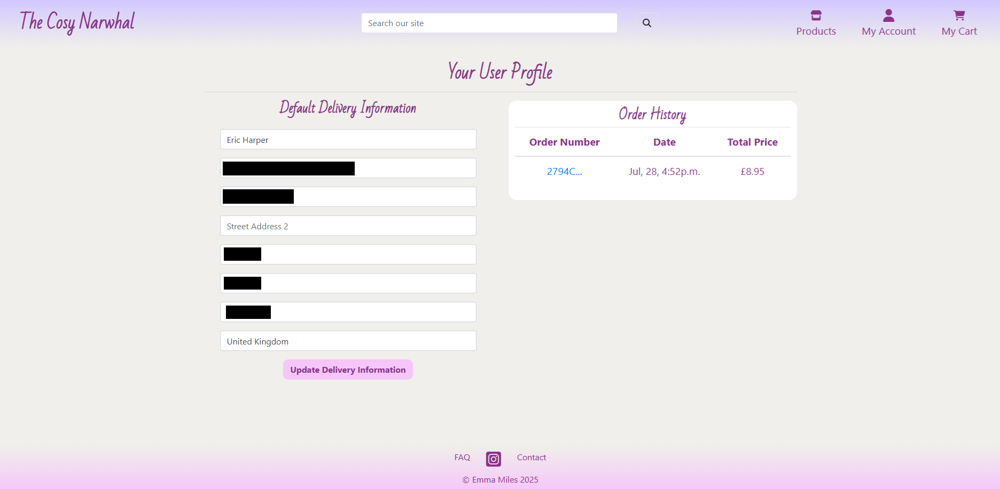
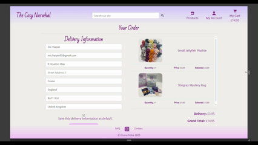

# The Cosy Narwhal - Handmade Crochet Toys
This project was a collaboration with my friend, Emma, who makes crochet toys and accessories, to create an e-commerce platform for her products.

# Code Institute Project Milestone 4 - Django Full Stack E-Commerce Development

## Table of Contents

1. [Live Demo](#demo)
2. [Database](#database)
   + [Product Model](#product-model)
   + [Order Model](#order-model)
   + [Profile Model](#profile-model)
3. [User Stories](#user-stories)
    + [Customer User Stories](#customer-user-stories)
    + [Admin User Stories](#admin-user-stories)
    + [General User Stories](#general-user-stories)
4. [Design](#design)
5. [Technologies](#technologies)
6. [Features](#features)
    + [Product Display & Cart](#product-display--cart)
        + [All Products & Search](#all-products--search)
        + [Product Detail](#product-detail)
        + [Add to Cart](#add-to-cart)
        + [View Cart](#view-cart)
    + [Account Registration & User Profile](#account-registration--user-profile)
        + [Registration](#registration)
        + [Profile & Order History](#profile--order-history)
    + [Checkout & Stripe](#checkout--stripe)
        + [Checkout](#checkout)
        + [Stripe Integration](#stripe-integration)
    + [Product Management](#product-management)
        + [Add Product](#add-product)
        + [Edit Product](#edit-product)
        + [Remove Product](#remove-product)
        + [Update Inventory](#update-inventory)
        + [Sales Report](#sales-report)
    + [FAQ & Contact](#faq--contact)
8. [Deployment](#deployment)
9. [Testing](#testing)
   + [Validation](#validation)
   + [Feature Testing](#feature-testing)
   + [Responsive UI Testing](#responsive-ui-testing)
   + [Browser Compatibility](#browser-compatibility)
   + [User Story Testing](#user-story-testing)
11. [Credits](#credits)

## Demo
A live demo to the website can be found [here](https://the-cosy-narwhal-0266caf0f910.herokuapp.com)

## Database

   
ERD Diagram

   

## Product Model

The `Product` model represents an individual handmade crochet toy. It defines all the core attributes necessary to manage product listings, variants, pricing, inventory, and image data.

### **Field Breakdown**

| Field | Type | Description |
|-------|------|-------------|
| `code` | `CharField` | SKU code for the product, prefixed by product type, eg WHA for Whale. Required.|
| `name` | `CharField` | The name/title of the product. Required. |
| `description` | `TextField` | A detailed description of the product. |
| `size` | `IntegerField` (choices) | Indicates the product's size, using predefined options: `Small (0)`, `Medium (1)`, and `Large (2)`. Defaults to `Small`. |
| `has_colors` | `BooleanField` | Flags whether the product comes in multiple colors. |
| `color` | `ForeignKey` → `Color` | Optionally links a product to a default or featured color. Can be null/blank. |
| `available_colors` | `ManyToManyField` → `Color` | Links a product to all colors it's available in. |
| `price` | `DecimalField` | The retail price of the product. Max 6 digits with 2 decimal places. |
| `rating` | `DecimalField` | The product's average customer rating (e.g. 4.5). Nullable and defaults to 0. |
| `image` | `ImageField` | Allows uploading an image file via Django. Stored in the `media/` folder using S3. |
| `image_url` | `URLField` | Stores the full URL to the product image. Automatically updated from the `image` field if present. |
| `inventory` | `IntegerField` | Tracks how many units are in stock. Defaults to 0. Cannot be blank. |

### **Custom `save` Method**

The `save()` method is overridden to keep the `image_url` field synchronized with the `image` field. When an image is uploaded:

1. Django saves the image file.
2. If the `image_url` doesn't match the uploaded image's `.url`, it's updated.
3. A second save is triggered with `update_fields=['image_url']` to persist the change.

This ensures consistent linking between uploaded images and their web-accessible URLs.

### **String Representation**

The `__str__` method returns the product’s name, which makes the model more readable in admin panels, shell, and debugging output.

### **Design Notes**

- The `size` field uses `choices`, making it easy to render dropdowns in forms and translate values in templates.
- The use of both `color` (single default color) and `available_colors` (multiple options) allows flexibility in how color variants are handled on product pages.
- Image support includes both uploaded files (`image`) and external URLs (`image_url`), making it compatible with S3, CDN-hosted images, or local storage.

Product Model shown here

   
      class Product(models.Model):
       SIZE = (
           (0,'Small'),
           (1, 'Medium'),
           (2, 'Large')
           )
       code = models.CharField(max_length=254, null=True, blank=True)
       name = models.CharField(max_length=254)
       description = models.TextField()
       size = models.IntegerField(choices=SIZE, null=False, blank=False, default=0)
       has_colors = models.BooleanField(default=False, null=True, blank=True)
   
       color = models.ForeignKey(
           'Color',
           null=True,
           blank=True,
           on_delete=models.SET_NULL,
           related_name='products_by_color'
       )
   
       available_colors = models.ManyToManyField(
           'Color',
           blank=True,
           related_name='products_available_colors'
       )
       
       price = models.DecimalField(max_digits=6, decimal_places=2)
       rating = models.DecimalField(max_digits=6, decimal_places=2, null=True, blank=True, default=0)
       image = models.ImageField(upload_to='media', null=True, blank=True)
       image_url = models.URLField(max_length=1024, null=True, blank=True)
       inventory = models.IntegerField(null=True, blank=False, default=0)
   
       def save(self, *args, **kwargs):
               super().save(*args, **kwargs)
               if self.image:
                   # Update image_url with the full URL to the S3 image
                   if self.image_url != self.image.url:
                       self.image_url = self.image.url
                       # Save again to update image_url field
                       super().save(update_fields=['image_url'])
   
       def __str__(self):
           return self.name

## Order Model

The `Order` model represents a single customer purchase transaction. It stores all relevant user data, item details, pricing, and shipping information.

### **Field Breakdown**

| Field | Type | Description |
|-------|------|-------------|
| `order_number` | `CharField` | A unique, non-editable identifier for the order. Automatically generated using a UUID. |
| `user` | `ForeignKey` → `AUTH_USER_MODEL` | Links the order to a registered user (optional). Allows guest checkout by making it nullable. |
| `email` | `EmailField` | Email address associated with the order. Used for receipts and contact. Defaults to `'Unknown'`. |
| `items` | `JSONField` | Stores all purchased product data (product IDs, names, quantities, prices) in structured JSON format. |
| `total_price` | `DecimalField` | The total price of the order. Validated to be 0 or greater. |
| `created_at` | `DateTimeField` | Timestamp when the order was created. Automatically set on creation. |
| `updated_at` | `DateTimeField` | Timestamp when the order was last updated. Automatically refreshed on save. |

### **Delivery Information Fields**

| Field | Type | Description |
|-------|------|-------------|
| `full_name` | `CharField` | Full name of the recipient. |
| `street_address1` | `CharField` | Primary street address for delivery. |
| `street_address2` | `CharField` | Secondary address line (optional). |
| `town_or_city` | `CharField` | The town or city of the shipping address. |
| `county` | `CharField` | County or region (optional). |
| `postcode` | `CharField` | Postal code for delivery. |
| `country` | `CharField` | Country of the shipping address. |

Most fields have default values to prevent validation errors during anonymous or incomplete orders.

### **Custom `save()` Method**

The `save()` method is overridden to ensure each order is assigned a unique `order_number` before it’s saved:

1. If `order_number` is not already set,
2. A UUID is generated using the `_generate_order_number()` method,
3. The order is then saved normally.

This guarantees that each order is uniquely identifiable, even for guest checkouts.

### **Private `_generate_order_number()` Method**

`def _generate_order_number(self):
    return uuid.uuid4().hex.upper()`
    
This helper method returns a UUID-based string in uppercase hexadecimal format to uniquely identify the order.

### **String Representation**

The `__str__()` method returns the `order_number`, which helps with readable logs and admin display.

## **Design Notes**

- Uses `JSONField` for `items` to flexibly store varying order structures without requiring a separate `OrderItem` model.
- Supports both registered and guest users (`user` is nullable).
- Automatically tracks creation and update times for auditing and admin use.
- Can be extended later to include order status, payment confirmation, shipping tracking, etc.

Order Model shown here

      class Order(models.Model):
          order_number = models.CharField(max_length=32, unique=True, editable=False)
          user = models.ForeignKey(settings.AUTH_USER_MODEL, null=True, blank=True, on_delete=models.CASCADE)
          email = models.EmailField(max_length=254, default='Unknown')
          items = models.JSONField()  # or Postgres JSONField if needed
          total_price = models.DecimalField(
              max_digits=10,
              decimal_places=2,
              validators=[MinValueValidator(0)]
          )
          created_at = models.DateTimeField(auto_now_add=True)
          updated_at = models.DateTimeField(auto_now=True)

          # Delivery information fields
          full_name = models.CharField(max_length=100, default='Unknown')
          street_address1 = models.CharField(max_length=80, default='Unknown')
          street_address2 = models.CharField(max_length=80, blank=True)
          town_or_city = models.CharField(max_length=40, default='Unknown')
          county = models.CharField(max_length=80, blank=True)
          postcode = models.CharField(max_length=20, default='Unknown')
          country = models.CharField(max_length=40, default='Unknown')
         
          def save(self, *args, **kwargs):
              if not self.order_number:
                  self.order_number = self._generate_order_number()
              super().save(*args, **kwargs)
         
          def _generate_order_number(self):
              return uuid.uuid4().hex.upper()
         
          def __str__(self):
              return self.order_number

## Profile Model

The `Profile` model is used to store additional user information related to billing or shipping addresses. It extends the default user model with structured address fields, allowing for quicker checkouts and a better user experience.

### **Field Breakdown**

| Field | Type | Description |
|-------|------|-------------|
| `user` | `OneToOneField` → `AUTH_USER_MODEL` | Links one profile to one user account. Ensures a unique profile per user. If the user is deleted, the profile is also removed (`on_delete=CASCADE`). |
| `full_name` | `CharField` | The user's full name for identification and address purposes. |
| `street_address1` | `CharField` | The primary street address. Required. |
| `street_address2` | `CharField` | Secondary address line (optional). Useful for apartment or suite numbers. |
| `town_or_city` | `CharField` | City or town portion of the user's address. |
| `county` | `CharField` | County or region information. |
| `postcode` | `CharField` | Postal or ZIP code. |
| `country` | `CharField` | Country of residence. Could be upgraded to a country-select field in the future. |

### **String Representation**

The `__str__()` method returns the associated user's `username`, making it easy to identify profiles in the Django admin or logs.

### **Design Notes**

- Used for pre-filling checkout forms and maintaining shipping info between sessions.
- Ensures personal address data is kept separate from the core `User` model.
- The one-to-one relationship enforces a strict 1:1 connection between users and profiles.
- Could be extended to store phone numbers, preferences, or default payment methods.

Profile Model shown here

      class Profile(models.Model):
          user = models.OneToOneField(settings.AUTH_USER_MODEL, on_delete=models.CASCADE)
          full_name = models.CharField(max_length=150)
          street_address1 = models.CharField(max_length=255)
          street_address2 = models.CharField(max_length=255, blank=True, null=True)
          town_or_city = models.CharField(max_length=100)
          county = models.CharField(max_length=100)
          postcode = models.CharField(max_length=20)
          country = models.CharField(max_length=100)
      
          def __str__(self):
              return self.user.username

## User Stories
I decided to break the User Stories into three Epics, based on customer needs, admin needs and general functionality of the website. Each of these is explained and explored, along with acceptance criteria and using the Given/When/Then/And structure.
## Customer User Stories

### Browse Products
**User Story**  
_As a guest user, I want to browse all available crochet toys, so I can see what's available without creating an account._

**Acceptance Criteria**
- **Given** I’m on the homepage or product listing page  
- **When** I load the page  
- **Then** I see a grid or list of all available crochet toys with images and titles

### View Product Details
**User Story**  
_As a guest user, I want to view product details including size, color, and images, so I can make informed purchase decisions._

**Acceptance Criteria**
- **Given** I click on a product  
- **When** the product detail page loads  
- **Then** I see the name, description, price, size options, color options, and product image(s)

### Guest Checkout
**User Story**  
_As a guest user, I want to add items to my cart and checkout without creating an account, so I can shop quickly and easily._

**Acceptance Criteria**
- **Given** I have added at least one item to my cart  
- **When** I go to checkout  
- **Then** I am not required to sign up or log in  
- **And** I can proceed directly to payment

### Stripe Payment
**User Story**  
_As a customer, I want to pay securely using Stripe, so I can trust the payment process._

**Acceptance Criteria**
- **Given** I’m on the checkout page  
- **When** I submit my payment information  
- **Then** Stripe securely processes the payment  
- **And** I receive a success or failure message

### Order Confirmation
**User Story**  
_As a customer, I want to receive confirmation of my order, so I know it was successfully placed._

**Acceptance Criteria**
- **Given** I’ve completed a purchase  
- **When** the payment is confirmed  
- **Then** I see an order confirmation page  
- **And** I receive a confirmation email

### Product Reviews
**User Story**  
_As a customer, I want to leave a review on products I’ve purchased, so I can share my experience with others._

**Acceptance Criteria**
- **Given** I have completed an order  
- **When** I navigate to the product page  
- **Then** I can submit a star rating and comment  
- **And** the review is displayed publicly once submitted

### Contact Form for Custom Orders
**User Story**  
_As a potential customer, I want to use a contact form to ask about custom crochet orders, so I can request personalized products._

**Acceptance Criteria**
- **Given** I’m on the contact page  
- **When** I fill in the form with my name, email, and message  
- **And** I click submit  
- **Then** I receive a success message  
- **And** my message is sent to the admin’s email or dashboard

## Admin User Stories

### Add Products
**User Story**  
_As an admin, I want to add new crochet toys to the store, so I can keep my catalog up to date._

**Acceptance Criteria**
- **Given** I am logged in as an admin  
- **When** I access the product dashboard and click “Add Product”  
- **Then** I can enter product name, description, size, color, price, image, and inventory  
- **And** the new product appears on the store page

### Edit Products
**User Story**  
_As an admin, I want to edit product information, so I can fix errors or make updates._

**Acceptance Criteria**
- **Given** I am logged in as an admin  
- **When** I access the product list and “Edit” a product  
- **Then** I can modify the product's fields  
- **And** changes are reflected on the frontend

### Remove Products
**User Story**  
_As an admin, I want to remove discontinued products, so customers only see available items._

**Acceptance Criteria**
- **Given** I am logged in as an admin  
- **When** I access the product list and “Delete” a product  
- **Then** the product is no longer visible in the store

### Update Inventory
**User Story**  
_As an admin, I want to update inventory levels, so I can track stock accurately._

**Acceptance Criteria**
- **Given** I am logged in as an admin  
- **When** I change a product’s inventory count  
- **Then** the new quantity is saved  
- **And** the stock level affects whether it is shown as “in stock” or “sold out”

### View Sales Reports
**User Story**  
_As an admin, I want to view sales reports, so I can monitor revenue and product performance._

**Acceptance Criteria**
- **Given** I am logged in as an admin  
- **When** I access the dashboard's reporting section  
- **Then** I see metrics like total sales, number of orders, and top-selling products

## General User Stories

### Responsive Design
**User Story**  
_As a user, I want the website to be responsive on mobile and desktop, so I can browse and shop comfortably from any device._

**Acceptance Criteria**
- **Given** I visit the site on different screen sizes  
- **When** I interact with the UI  
- **Then** the layout adjusts appropriately  
- **And** all functionality remains usable

### Fast Navigation
**User Story**  
_As a user, I want the platform to load quickly and be easy to navigate, so I can enjoy a smooth shopping experience._

**Acceptance Criteria**
- **Given** I move between pages  
- **When** I click on navigation links  
- **Then** the pages load in under 3 seconds  
- **And** the structure is consistent and intuitive

### Reliable Contact Form
**User Story**  
_As a user, I want the contact form to be accessible and reliable, so I can reach out to the seller without issues._

**Acceptance Criteria**
- **Given** I fill in the contact form with valid data  
- **When** I submit it  
- **Then** the message is sent successfully  
- **And** I see a clear confirmation message

## Design

Taking into account Strategy, Scope, Structure, Skeleton and Surface, together with User Stories and desired outcomes, this is what I considered while building this project.

Given this was a collaborative project, the colour scheme was set by Emma's branding choices, as she already had a logo and colour selection available as well as a main font. Unfortunately, the font she uses in her branding is a Canva exclusive font and as such, we worked together to find one available on Google Fonts that match it closely for consistency.

   
Brand Logo

   

   
Color Palette

   

I chose a fixed top navigation style as it is both consistent accross multiple screen types and is intuative to use and navigate. This also allows for easy and maximal display for products and information as there is nothing "inside" the screen where this infomation would be presented.

A wireframe for the initial design concepts can be found in the [technologies](#technologies) section.

## Technologies
**HTML** - To create a basic site skeleton and add the content. The site consists of HTML template partials loaded within the **base.html** template.

base.html is shown here

    
      
      
      <!doctype html>
      <html lang="en">
      
      <head>
          
          <!-- Required meta tags -->
          <meta http-equiv="X-UA-Compatible" content="ie=edge">
          <meta charset="utf-8">
          <meta name="viewport" content="width=device-width, initial-scale=1, shrink-to-fit=no">
          
      
          
          
      
          
          <!-- Bootstrap CSS -->
          <link rel="stylesheet" href="https://cdn.jsdelivr.net/npm/bootstrap@4.6.2/dist/css/bootstrap.min.css"
              integrity="sha384-xOolHFLEh07PJGoPkLv1IbcEPTNtaed2xpHsD9ESMhqIYd0nLMwNLD69Npy4HI+N" crossorigin="anonymous">
          <!-- Googlefonts Import-->
          <link rel="preconnect" href="https://fonts.googleapis.com">
          <link rel="preconnect" href="https://fonts.gstatic.com" crossorigin>
          <link
              href="https://fonts.googleapis.com/css2?family=Bad+Script&family=Lato:ital,wght@0,100;0,300;0,400;0,700;0,900;1,100;1,300;1,400;1,700;1,900&display=swap"
              rel="stylesheet">
          <!-- Core Custom CSS -->
          <link href="" rel="stylesheet">
          
      
          
          
      
          
          <!-- Bootstrap JS -->
          
          
          
          <!-- FontAwesome Kit -->
          
          <!-- Stripe JS -->
          
          
      
          
          
      
          <title>The Cosy Narwhal - Handmade Crochet</title>
      </head>
      
      <body>
          <header class="container-fluid fixed-top">
              

                  

                      <a href="" class="nav-link main-logo-link">
                          <h2 class="logo-font text-black m-0">The Cosy Narwhal</h2>
                      </a>
                  

      
                  

                      <form method="GET" action="" class="w-100">
                          

                              <input class="form-control border border-black rounded" 
                                  type="text" name="q"
                                  placeholder="Search our site"
                                  value="{{ search_term|default:'' }}">
                              

                                  <button aria-label="search" class="btn btn-black border border-black rounded" type="submit">
                                      <i class="fas fa-search"></i>
                                  </button>
                              

                          

                      </form>
                  

      
                  

                      <ul class="list-inline list-unstyled m-0 d-flex align-items-center">
                          <li class="list-inline-item dropdown mx-2">
                              <a class="text-black nav-link" aria-label="Main products display page" href="">
                                  

                                      
<i class="fa-solid fa-store"></i>

                                      
Products

                                  

                              </a>
                          </li>
                          <li class="list-inline-item dropdown mx-2">
                              <a class="text-black nav-link" href="#" id="user-options" data-toggle="dropdown"
                                  aria-haspopup="true" aria-expanded="false" aria-label="Account options">
                                  

                                      
<i class="fas fa-user fa-lg"></i>

                                      
My Account

                                  

                              </a>
                              

                                  
                                  
                                  <a href="" class="dropdown-item">Product Management</a>
                                  
                                  <a href="" class="dropdown-item">My Profile</a>
                                  <a href="" class="dropdown-item">Logout</a>
                                  
                                  <a href="" class="dropdown-item">Register</a>
                                  <a href="" class="dropdown-item">Login</a>
                                  
                              

                          </li>
                          <li class="list-inline-item mx-2">
                              <a class="nav-link" aria-label="View your cart" href="">
                                  

                                      
<i class="fa-solid fa-cart-shopping"></i>

                                      
My Cart

                                      

                                          
                                          £{{ grand_total|floatformat:2 }}
                                          
                                          
                                      

                                  

                              </a>
                          </li>
                      </ul>
                  

              

              

                  <nav class="navbar navbar-expand-lg navbar-light w-100">
                      
                  </nav>
              

          </header>
          

          
          
          

          
          
          

              
              
              
              
              
              
              
              
              
              
              
              
              
          

          
          
          
          
          <footer class="footer bg-grad-rev w-100 d-lg-flex fixed-bottom">
              
          </footer>
      </body>
      </html>

**CSS** - To create a controlled and consistent display for each element and to give a great user experience.

**Javascript** - Several small scripts are implemented on pages that require them such as change listeners to redirect to different colours on the product page and Stripe integration.

**Django** - This was the meat of the project, enabling full Admin user controlled CRUD functionality for the products in the database. I used customised AllAuth templates to enable greater customisation of AllAuth forms.

**Balsamiq** - To create a wireframe, [here](./the-cosy-narwhal-assets/the-cosy-narwhal.pdf) (pdf format)

**Bootstrap** - To ensure responsive design and usability across all devices, I use a combination of Bootstrap classes and custom css.

## Features
Most of the features I implemented were the direct responses to the User Stories listed above, as such, here follows an explanation of them in greater detail.

### Product Display & Cart
#### All Products & Search
Displays the complete catalog of crochet toys with images, titles, and key details so users can browse available items easily. The main porduct pages users a custom filter in the view to group products by product code, and only display the products considered unique within that set. This however is different when displaying a search result, as then, it will show all results that match the search criteria without filtering the product codes.

Within the template, there are conditional statements that display information about wether the item is in stock or has additional color options.

   
Conditional Statements from template

         
<strong>{{ product.display_name }}</strong>

         # If product is out of stock
         
         <small>Currently out of stock</small>
         
         # If product has color options
         
         <small>Color choices available</small>
         

   
Product View

   
      def all_products(request):
       query = request.GET.get('q', '')
       all_products = Product.objects.order_by('code', 'id')
   
       if query:
           # Search: show all matching with full product names (no trimming)
           all_products = all_products.filter(
               Q(name__icontains=query) | Q(description__icontains=query)
           )
           products_to_show = all_products
           for product in products_to_show:
               product.display_name = product.name  # full name with variant info
       else:
           # No search: show unique prefixes with trimmed names
           seen_prefixes = set()
           unique_products = []
           for product in all_products:
               prefix = product.code[:3]
               if prefix not in seen_prefixes:
                   if '-' in product.name:
                       product.display_name = product.name.split('-')[0].strip()
                   else:
                       product.display_name = product.name
                   unique_products.append(product)
                   seen_prefixes.add(prefix)
           products_to_show = unique_products
   
       context = {
           'products': products_to_show,
           'search_term': query,
       }
   
       return render(request, 'product/product.html', context)

   
Screenshot of Main Products Page

   

   
Screenshot of Search Results Page

#### Product Detail
Allows users to see detailed information about the selected product. Once the user has selected a product the product detail view renders that products full display information, including its description and any reveiws left for the product.

The same conditional statements exist on this page however, the out of stock statement will now disable the "Add to Cart" button if the item is not in stock and change its text to reflect this. Additionally there is a limit place on the quantity selector that forbids users adding more than the currently available stock to the cart as a defensive measure against overordering.

Addotionally, this is the page where users can leave a review of the product, which is restricted by searching the users order history and only allowing reviews if they have previoulsy ordered the product, and is restricted to one review per person per product.

   
Defensive Programming snippet

      <form class="d-flex align-items-center gap-2" method="POST" action="">
           
           <input class="rounded form-control w-auto"
               type="hiddennumber" name="quantity"
               value="1" min="1" max="{{ product.inventory }}">

           <input type="hidden" name="redirect_url" value="{{ request.path }}">

           <button class="btn btn-def disabled" type="submit" disabled>
               Sorry, I'm currently out of stockAdd to Cart
           </button>
       </form>

   
Product Detail View

   
      def product_detail(request, product_id):
          product = get_object_or_404(Product, pk=product_id)
      
          prefix = product.code[:3]
          variant_products = Product.objects.filter(code__startswith=prefix).order_by('id')
      
          # Build color_links
          color_links = []
          for color in product.available_colors.all():
              variant = variant_products.filter(color=color).first()
              if variant:
                  color_links.append((color.name.lower(), variant.id))
          color_links.sort(key=lambda x: x[0])
      
          # Build size_links
          size_links = []
          for size_value, size_label in Product.SIZE:
              if size_value == product.size:
                  continue
              variant = variant_products.filter(size=size_value, color=product.color).first()
              if variant:
                  size_links.append((size_value, size_label, variant.id))
      
          reviews = product.reviews.all().order_by('-created_at')
      
          # Check if user can leave a review
          can_review = False
          if request.user.is_authenticated:
              already_reviewed = reviews.filter(user=request.user).exists()
      
              if not already_reviewed:
                  user_orders = Order.objects.filter(user=request.user)
                  for order in user_orders:
                      if product.code in order.items:
                          can_review = True
                          break
      
          # Only accept POST if allowed
          if request.method == 'POST' and can_review:
              form = ReviewForm(request.POST)
              if form.is_valid():
                  review = form.save(commit=False)
                  review.product = product
                  review.user = request.user
                  review.save()
                  return redirect('product_detail', product_id=product.id)
          else:
              form = ReviewForm()
      
          context = {
              'product': product,
              'product_id_str': str(product.id),
              'color_links': color_links,
              'size_links': size_links,
              'reviews': reviews,
              'form': form,
              'can_review': can_review,
          }
      
          return render(request, "product/product_detail.html", context)

   
Screenshot of Product Detail Page

#### Add to Cart
Enables users to add selected products to their shopping cart for purchase. By clicking the "Add to Cart" button the add_to_bag view is called. This take the product code and matches it to the product id within the database, and also gets the color and/ or size chosen along with the quantity. Then adds this information to the bag session object and displays a toast to the user showing how many and of what has been added to the bag. The grand total under the "My Cart" nav-link will also update dynamically as products are added.

   
Add to Bag View

   
      def add_to_bag(request, item_id):
          quantity = int(request.POST.get('quantity', 1))
          redirect_url = request.POST.get('redirect_url')
      
          try:
              product = Product.objects.get(code=item_id)
          except Product.DoesNotExist:
              messages.error(request, "Sorry, that product does not exist.")
              return redirect('home') 
      
          color = format_color_name(product.color.name) if product.color else "N/A"
          size = product.get_size_display() if hasattr(product, 'get_size_display') else "N/A"
      
          bag = request.session.get('bag', {})
      
          if item_id in bag:
              bag[item_id] += quantity
          else:
              bag[item_id] = quantity
      
          request.session['bag'] = bag
      
          messages.success(request, f"Added {product.name} (Color: {color}, Size: {size}) to your bag.")
      
          return redirect(redirect_url)

#### View Cart
Displays the contents of the user’s cart, showing product details, quantities, and total price before checkout. This view also allows the user to remove items from the bag. First the view collects the information from the session and adds it to the `order_items` list to make a secondary list of the bag items for processing. Then for each item in the bag session, the template renders it within a table displaying its information, along with the delivery charge to be applied and the grand total of products cost and delivery charge.

   
Bag Summary View

      def view_bag(request):
          bag = request.session.get('bag', {})
      
          order_items = []
          total_price = 0
      
          for code, qty in bag.items():
              try:
                  product = Product.objects.get(code=code)
                  line_total = product.price * qty
                  total_price += line_total
                  order_items.append({
                      'product': product,
                      'quantity': qty,
                      'line_total': line_total,
                  })
              except Product.DoesNotExist:
                  continue
      
          delivery_charge, delivery_type, grand_total = calculate_delivery(order_items)
      
          context = {
              'bag': bag, 
              'order_items': order_items,
              'total_price': total_price,
              'delivery_charge': delivery_charge,
              'delivery_type': delivery_type,
              'grand_total': grand_total,
          }
      
          return render(request, 'bag/bag.html', context)

   
Screenshot of Cart Summary Page

### Account Registration & User Profile
#### Registration
Provides a form for users to create a new account by entering necessary details such as email and password. To allow for more control over the all-auth template, I used a custom sign up form to capture the delivery information and have a custom rendering style. This removes the labels and uses placeholders to show users what each field requires. I feel this presents a cleaner and more streamlined form to the user, improving overall user experience. When the sign up is complete, the users profile is created and the default delivery information in populated with these values to prepare for orders being placed.

   
Custom Sign Up Form

      class CustomSignupForm(SignupForm):
          full_name = forms.CharField(
              max_length=150,
              label="",
              widget=forms.TextInput(attrs={"placeholder": "Full Name"}),
          )
          street_address1 = forms.CharField(
              max_length=255,
              label="",
              widget=forms.TextInput(attrs={"placeholder": "Street Address 1"}),
          )
          street_address2 = forms.CharField(
              max_length=255,
              required=False,
              label="",
              widget=forms.TextInput(attrs={"placeholder": "Street Address 2 (Optional)"}),
          )
          town_or_city = forms.CharField(
              max_length=100,
              label="",
              widget=forms.TextInput(attrs={"placeholder": "Town or City"}),
          )
          county = forms.CharField(
              max_length=100,
              label="",
              widget=forms.TextInput(attrs={"placeholder": "County"}),
          )
          postcode = forms.CharField(
              max_length=20,
              label="",
              widget=forms.TextInput(attrs={"placeholder": "Postcode"}),
          )
          country = forms.CharField(
              max_length=100,
              label="",
              widget=forms.TextInput(attrs={"placeholder": "Country"}),
          )
      
          def __init__(self, *args, **kwargs):
              super().__init__(*args, **kwargs)
      
              self.helper = FormHelper()
              self.helper.form_method = "post"
              self.helper.add_input(Submit("submit", "Sign Up", css_class="btn btn-def"))
      
              # Set placeholders for built-in fields
              self.fields["username"].widget.attrs.update({"placeholder": "Username"})
              self.fields["email"].widget.attrs.update({"placeholder": "Email"})
              self.fields["password1"].widget.attrs.update({"placeholder": "Password"})
              self.fields["password2"].widget.attrs.update(
                  {"placeholder": "Confirm Password"}
              )
              self.fields["password1"].help_text = """
                  

                      Your password can't be too similar to your other personal information.
                       
                      Your password must contain at least 8 characters.
                       
                      Your password can't be a commonly used password.
                       
                      Your password can't be entirely numeric.
                  

              """
      
              # Remove labels from all fields
              for field in self.fields.values():
                  field.label = ""
      
          def save(self, request):
              user = super().save(request)
      
              # update profile fields as you already do
              profile = user.profile
              profile.full_name = self.cleaned_data['full_name']
              profile.street_address1 = self.cleaned_data['street_address1']
              profile.street_address2 = self.cleaned_data.get('street_address2', '')
              profile.town_or_city = self.cleaned_data['town_or_city']
              profile.county = self.cleaned_data['county']
              profile.postcode = self.cleaned_data['postcode']
              profile.country = self.cleaned_data['country']
              profile.save()
      
              return user

   
Screenshot of the Sign Up Form

)

#### Profile & Order History
Allows registered users to view and update their personal information. The profile page also shows the Delivery Information form which autopopulates upon sign up but can be edited here if the information has changed. If the user has placed any orders, they will also be displayed here, with the ability to look at the order summary.

   
Profile View

      @login_required
      def profile_view(request):
          profile = request.user.profile  # Assumes a Profile instance exists
          past_orders = Order.objects.filter(user=request.user).order_by('-created_at')
      
          if request.method == 'POST':
              # Update profile with submitted form data
              profile.full_name = request.POST.get('full_name', profile.full_name)
              profile.street_address1 = request.POST.get('street_address1', profile.street_address1)
              profile.street_address2 = request.POST.get('street_address2', profile.street_address2)
              profile.town_or_city = request.POST.get('town_or_city', profile.town_or_city)
              profile.county = request.POST.get('county', profile.county)
              profile.postcode = request.POST.get('postcode', profile.postcode)
              profile.country = request.POST.get('country', profile.country)
              profile.save()
      
              messages.success(request, 'Your profile has been updated successfully!')
              return redirect('profile')  # Reload page after saving
      
          context = {
              'profile': profile,
              'past_orders': past_orders,
          }
          return render(request, 'profiles/profile.html', context)

   
Delivery Information Form

   
      class DeliveryInfoForm(forms.ModelForm):
          email = forms.EmailField(
              required=True,  # Not required since it won't be edited here
              widget=forms.EmailInput(attrs={
                  'placeholder': 'Email Address',
                  'class': 'form-control',
              }),
              label='',
          )
      
          class Meta:
              model = Profile
              fields = [
                  'full_name',
                  # we won't include email here because it's a separate field
                  'street_address1',
                  'street_address2',
                  'town_or_city',
                  'county',
                  'postcode',
                  'country',
              ]
              widgets = {
                  'full_name': forms.TextInput(attrs={'placeholder': 'Full Name'}),
                  'street_address1': forms.TextInput(attrs={'placeholder': 'Street Address 1'}),
                  'street_address2': forms.TextInput(attrs={'placeholder': 'Street Address 2'}),
                  'town_or_city': forms.TextInput(attrs={'placeholder': 'Town or City'}),
                  'county': forms.TextInput(attrs={'placeholder': 'County'}),
                  'postcode': forms.TextInput(attrs={'placeholder': 'Postcode'}),
                  'country': forms.TextInput(attrs={'placeholder': 'Country'}),
              }
      
          def __init__(self, *args, **kwargs):
              user_email = kwargs.pop('user_email', None)
              super().__init__(*args, **kwargs)
      
              # Set the email field value to user email and keep it disabled
              if user_email:
                  self.fields['email'].initial = user_email
      
              for field_name, field in self.fields.items():
                  # form-control class for all except email (already set in widget attrs)
                  if field_name != 'email':
                      existing_classes = field.widget.attrs.get('class', '')
                      classes = (existing_classes + ' form-control').strip()
                      field.widget.attrs['class'] = classes
                  field.label = ''
      
                  field_order = [
                      'full_name',
                      'email',
                      'street_address1',
                      'street_address2',
                      'town_or_city',
                      'county',
                      'postcode',
                      'country',
                  ]
                  self.fields = {k: self.fields[k] for k in field_order if k in self.fields}

   
Screenshot of Profile Page (some information redacted)

   
Screenshot of Order Summary (some information redacted)

### Checkout & Stripe
#### Checkout
Guides users through the process of entering shipping and payment details to complete a purchase. This all begins at the `checkout_view`, which compiles the information from the session bag as well as the profile delivery information to create an informative and easy to follow checkout flow. Additionally, it allows for non-registered users to complete a checkout as well, so guests can make one off purchases.

Once the order has been processed, the user is shown a summary of the order by calling the `checkout_success` view and then the information is passed through to the `save_order` view, which submits the information to the database and stores the transaction with a list of the relevant inforamtion such as delivery details and ordered products. Addotionally as part of the `save_order` view, there is a checkbox that allows registered users to save the information that they have entered for delivery at this point, which will change the default values for future orders by updating the Profile of the user. As the order is not considered successful until we save the order, it is also at this point that the confirmation email is sent to the user.

   
Checkout View

   
      def checkout_view(request):
          print("Checkout view called with method:", request.method)
          bag = request.session.get('bag', {})
      
          # Build order summary & total price
          order_items = []
          total_price = 0
          for code, qty in bag.items():
              try:
                  product = Product.objects.get(code=code)
                  line_total = product.price * qty
                  total_price += line_total
                  order_items.append({
                      'product': product,
                      'quantity': qty,
                      'line_total': line_total,
                  })
              except Product.DoesNotExist:
                  continue
      
          delivery_charge, delivery_type, grand_total = calculate_delivery(order_items)
          
          # Authenticated user data (if available)
          profile = None
          user_email = ''
          if request.user.is_authenticated:
              profile = getattr(request.user, 'profile', None)
              user_email = request.user.email
      
          if request.method == 'POST':
              form = DeliveryInfoForm(request.POST, instance=profile, user_email=user_email)
              if form.is_valid():
                  # Capture the save_info checkbox value ('on' if checked)
                  save_info = request.POST.get('save_info') == 'on'
      
                  # Save delivery info in session
                  delivery_data = form.cleaned_data
                  request.session['delivery_info'] = {
                      'email': delivery_data.get('email'),
                      'full_name': delivery_data.get('full_name', ''),
                      'street_address1': delivery_data.get('street_address1', ''),
                      'street_address2': delivery_data.get('street_address2', ''),
                      'town_or_city': delivery_data.get('town_or_city', ''),
                      'county': delivery_data.get('county', ''),
                      'postcode': delivery_data.get('postcode', ''),
                      'country': delivery_data.get('country', ''),
                  }
                  request.session['save_info'] = save_info
                  request.session.modified = True
                  # Create Stripe PaymentIntent
                  try:
                      metadata = {}
                      if request.user.is_authenticated:
                          metadata['user_id'] = request.user.id
      
                      intent = stripe.PaymentIntent.create(
                          amount=int(grand_total * 100),
                          currency='gbp',
                          metadata=metadata,
                      )
                  except Exception as e:
                      form.add_error(None, f"Payment initialization error: {e}")
                      return render(request, 'checkout/checkout.html', {
                          'order_items': order_items,
                          'total_price': total_price,
                          'delivery_charge': delivery_charge,
                          'delivery_type': delivery_type,
                          'grand_total': grand_total,
                          'form': form,
                          'bag_json': json.dumps(bag),
                          'delivery_info': request.session.get('delivery_info', {}),
                          'save_info': request.session.get('save_info', True),
                      })
      
                  return render(request, 'checkout/checkout.html', {
                      'order_items': order_items,
                      'total_price': total_price,
                      'delivery_charge': delivery_charge,
                      'delivery_type': delivery_type,
                      'grand_total': grand_total,
                      'form': form,
                      'stripe_public_key': settings.STRIPE_PUBLIC_KEY,
                      'client_secret': intent.client_secret,
                      'payment_phase': True,
                      'bag_json': json.dumps(bag),
                      'delivery_info': request.session.get('delivery_info', {}),
                      'save_info': request.session.get('save_info', True),
                  })
          else:
              form = DeliveryInfoForm(instance=profile, user_email=user_email)
      
          return render(request, 'checkout/checkout.html', {
              'order_items': order_items,
              'total_price': total_price,
              'delivery_charge': delivery_charge,
              'delivery_type': delivery_type,
              'grand_total': grand_total,
              'form': form,
              'bag_json': json.dumps(bag),
              'delivery_info': request.session.get('delivery_info', {}),
              'save_info': request.session.get('save_info', True),
          })

   
Screenshot of Checkout Summary Page (some information redacted)

   
Screenshot of Payment Phase

   
Checkout Success View

      def checkout_success(request, order_number):
          order = get_object_or_404(Order, order_number=order_number)
          
          # Decrement inventory for each product in the order
          for code, qty in order.items.items():
              try:
                  product = Product.objects.get(code=code)
                  product.inventory = max(product.inventory - qty, 0)  # Prevent negative inventory
                  product.save()
              except Product.DoesNotExist:
                  # Optionally log this or handle missing product case
                  continue
      
          request.session['bag'] = {}
          request.session.pop('order_data', None)
      
          # Build order items to show nicely
          order_items = []
          for code, qty in order.items.items():
              try:
                  product = Product.objects.get(code=code)
                  order_items.append({
                      'product': product,
                      'quantity': qty,
                      'line_total': product.price * qty,
                  })
              except Product.DoesNotExist:
                  continue
      
          delivery_charge, delivery_type, total_with_delivery = calculate_delivery(order_items)
      
          context = {
              'order': order,
              'order_items': order_items,
              'delivery_charge': delivery_charge,
              'delivery_type': delivery_type,
              'total_with_delivery': total_with_delivery,
          }
      
          return render(request, 'checkout/checkout_success.html', context)

   
Screenshot of Checkout Success, the lower part of the page shows delivery address and confirmation email address. This has been cut off for security.

   
Save Order View

   
      @csrf_protect
      def save_order(request):
          if request.method != 'POST':
              return JsonResponse({'error': 'POST request required'}, status=400)
      
          try:
              data = json.loads(request.body)
              bag = data.get('items')
              total_price = data.get('total_price')
      
              # Get delivery info
              email = data.get('email')
              full_name = data.get('full_name')
              street_address1 = data.get('street_address1')
              street_address2 = data.get('street_address2', '')
              town_or_city = data.get('town_or_city')
              county = data.get('county', '')
              postcode = data.get('postcode')
              country = data.get('country')
              save_info = data.get('save_info', True)  # Defaults to True if not sent
          except Exception:
              return JsonResponse({'error': 'Invalid JSON data'}, status=400)
      
          if not bag or total_price is None:
              return JsonResponse({'error': 'Invalid order data'}, status=400)
      
          user = request.user if request.user.is_authenticated else None
      
          # Save the order
          try:
              order = Order.objects.create(
                  user=user,
                  email=email,
                  items=bag,
                  total_price=total_price,
                  full_name=full_name,
                  street_address1=street_address1,
                  street_address2=street_address2,
                  town_or_city=town_or_city,
                  county=county,
                  postcode=postcode,
                  country=country,
              )
          except Exception as e:
              return JsonResponse({'error': f'Failed to save order: {str(e)}'}, status=500)
      
          # Save delivery info to profile if requested and user is authenticated
          if save_info and user is not None:
              profile = getattr(user, 'profile', None)
              if profile:
                  profile.full_name = full_name
                  profile.street_address1 = street_address1
                  profile.street_address2 = street_address2
                  profile.town_or_city = town_or_city
                  profile.county = county
                  profile.postcode = postcode
                  profile.country = country
                  profile.save()
          else:
              print("DEBUG: Not saving profile info or user not authenticated")
      
          # Build order items for email and delivery calculation
          order_items = []
          for code, qty in bag.items():
              try:
                  product = Product.objects.get(code=code)
                  line_total = product.price * qty
                  order_items.append({
                      'product': product,
                      'quantity': qty,
                      'line_total': line_total,
                  })
              except Product.DoesNotExist:
                  continue
      
          # Calculate delivery charge, type, and grand total
          delivery_charge, delivery_type, grand_total = calculate_delivery(order_items)
      
          try:
              context = {
                  'order_number': order.order_number,
                  'full_name': full_name,
                  'street_address1': street_address1,
                  'street_address2': street_address2,
                  'town_or_city': town_or_city,
                  'county': county,
                  'postcode': postcode,
                  'country': country,
                  'order_items': order_items,
                  'delivery_charge': delivery_charge,
                  'total': grand_total,
              }
      
              subject = f'The Cosy Narwhal - Order Number {order.order_number}'
              from_email = settings.DEFAULT_FROM_EMAIL
              to_email = [email]
      
              # Render both HTML and plain text (optional fallback)
              html_message = render_to_string('emails/conf_email.html', context)
              text_message = render_to_string('emails/conf_email.txt', context)  # Make this template too
      
              # Create and send the multi-part email
              msg = EmailMultiAlternatives(subject, text_message, from_email, to_email)
              msg.attach_alternative(html_message, "text/html")
              msg.send()
      
          except Exception as e:
              print("Failed to send confirmation email:", e)
      
          # Clear bag
          request.session['bag'] = {}
          request.session.save()
      
          return JsonResponse({'status': 'success', 'order_number': getattr(order, 'order_number', order.pk)})

#### Stripe Integration
Processes payments securely via Stripe, ensuring customer payment data is protected. Stripe is integrated using the code from Stripe docs. Javascript for this is shown below. This uses a minimal widget to ensure that the process is intuative and usable on any device. I've also implemented within the template of the checkout page, that this widget is hidden when you first navigate to it. After the user confirms the delivery information and is ready to continue, that section of the page is replaced with the payment widget. To make sure the information isn't lost, it is all stored in hidden inputs that can then be read after the payment widget has loaded.

   
Checkout Template

      
      
      
      
      <!-- Left side: Order Summary -->
      <h2>Your Order</h2>
      
      

      

          <!-- Right side: Delivery Form OR Stripe Payment Widget -->
          

              
              <h2>Complete Payment</h2>
              
Please enter your payment details below

              <form id="payment-form">
                  <!-- Hidden delivery fields pulled from session -->
                  <input type="hidden" name="email" value="{{ delivery_info.email }}">
                  <input type="hidden" name="full_name" value="{{ delivery_info.full_name }}">
                  <input type="hidden" name="street_address1" value="{{ delivery_info.street_address1 }}">
                  <input type="hidden" name="street_address2" value="{{ delivery_info.street_address2 }}">
                  <input type="hidden" name="town_or_city" value="{{ delivery_info.town_or_city }}">
                  <input type="hidden" name="county" value="{{ delivery_info.county }}">
                  <input type="hidden" name="postcode" value="{{ delivery_info.postcode }}">
                  <input type="hidden" name="country" value="{{ delivery_info.country }}">
                  <input type="hidden" id="save-info" name="save_info" value="{{ save_info|default_if_none:'true' }}">
      
                  
<!--Stripe.js injects the Card Element here-->
    
                  <button class="btn btn-def mt-3" id="submit">Pay £{{ grand_total|floatformat:2 }}</button>
                  

              </form>
              
              {{ grand_total|floatformat:2 }}
              
      
              
              <h2>Delivery Information</h2>
              <form method="post" action="">
                  
                  {{ form.as_p }}
                  
              

                  <input 
                      class="form-check-input mb-3" 
                      type="checkbox" 
                      id="save-info" 
                      name="save_info"
                      checked>
                  <label class="form-check-label mt-4" for="save-info">
                      Save this delivery Information as default.
                  </label>
              

              
                  <button class="btn btn-def mb-4" type="submit">Continue to Payment</button>
              </form>
              
          

          

              

                  <!-- Table display on larger screens -->
                  <table class="table d-none d-md-table">
                      <tbody>
                          
                          
                          <tr>
                              <td>
                                  
                                  
                                  
                                  
                                  
                              </td>
                              <td colspan="2">{{ product.name }}</td>
                          </tr>
                          <tr class="text-center product-info-checkout">
                              <td>
                                  <strong>Quantity: </strong> x{{ quantity }}
                              </td>
                              <td>
                                  <strong>Price: </strong>£{{ product.price }}
                              </td>
                              <td>
                                  <strong>Subtotal: </strong>£{{ product.price|multiply:quantity|floatformat:2 }}
                              </td>
                          </tr>
                          
                          
                          <tr>
                              <td colspan="5">Your cart is empty.</td>
                          </tr>
                          
                      </tbody>
                  </table>
                  <!-- Stacked div display on smaller screens -->
                  

                      
                      
                      

                          

                              

                                  
                                  
                                  
                                  
                                  
                              

                              

                                  <h6 class="mb-3">{{ product.name }}</h6>
                              

                              

                                  
<strong>Quantity: </strong>x{{ quantity }}

                                  
<strong>Price: </strong>£{{ product.price }}

                                  
<strong>Subtotal: </strong>£{{ product.price|multiply:quantity|floatformat:2 }}

                              

                          

                      

                      

                      
                      
                      
Your cart is empty.

                      
                  

              

              

              

                  
<strong>Delivery: </strong>£{{ delivery_charge|floatformat:2 }}

                  
<strong>Grand Total: </strong>£{{ grand_total|floatformat:2 }}

              

          

          

      

      
      

### Product Management
As product management should only be accessible by authorised users, I added a test to the views which enforces this.

      @user_passes_test(is_superuser)
      def product_management(request):
          return render(request, 'product/product_management.html')

The options for add, edit and inventory are all controlled by a single form that renders the fields as needed.

   
Screenshot of Product Management

   

   
Product Form

   
      class ProductForm(forms.ModelForm):
          class Meta:
              model = Product
              fields = [
                  'code',
                  'name',
                  'description',
                  'size',
                  'has_colors',
                  'color',
                  'available_colors',
                  'price',
                  'image',
                  'image_url',
                  'inventory',
              ]
              widgets = {
                  'description': forms.Textarea(attrs={'rows': 3}),
                  'available_colors': forms.CheckboxSelectMultiple(), 
              }
      
          def __init__(self, *args, **kwargs):
              super().__init__(*args, **kwargs)
              for field_name, field in self.fields.items():
                  # Skip adding form-control for checkbox/radio groups
                  if isinstance(field.widget, (forms.CheckboxSelectMultiple, forms.CheckboxInput, forms.RadioSelect)):
                      continue
                  # Add 'form-control' class
                  existing_classes = field.widget.attrs.get('class', '')
                  field.widget.attrs['class'] = f'{existing_classes} form-control'.strip()
      
      class ProductInventoryForm(forms.ModelForm):
          class Meta:
              model = Product
              fields = ['inventory']
              widgets = {
                  'inventory': forms.NumberInput(attrs={'class': 'form-control'}),
              }
      
      ProductInventoryFormSet = modelformset_factory(
          Product,
          form=ProductInventoryForm,
          extra=0
      )

#### Add Product
Enables admins to add new crochet toys by entering product details like name, description, price, size, color, images, and inventory. The template renders the Product Form with all fields blank, ready to recieve the new information and allows for superusers to add a product to the database. When submitted, the information is sent to the database and a new product is created.

   
Add Product View

   
      @user_passes_test(is_superuser)
      def add_product(request):
          if request.method == 'POST':
              form = ProductForm(request.POST, request.FILES) 
              if form.is_valid():
                  form.save()
                  new_product = form.save()
                  messages.success(request, f"'{new_product.name}' added successfully!")
                  return redirect('product_management') 
          else:
              form = ProductForm()
      
          return render(request, 'product/add_product.html', {'form': form})

   
Screenshot of Add Product Page

#### Edit Product
Allows admins to update existing product information and reflect changes on the storefront. Similarly to the `add_product` view, the `edit_product` view renders the Product Form, but this page has a dropdown menu that is populated by the products within the database. On selection, the fields are populated with the values of the selected product and allow for the superuser to edit and of these fields and then save the changes.

Additionally there is a search function at the top, allowing superusers to search for specific products instead of scrolling through the list in the dropdown. The search results act as links to populate the form with the selected product.

   
Edit Product View

      
      @user_passes_test(is_superuser)
      def edit_product(request):
          products = Product.objects.all().order_by('name')  # full list for dropdown
      
          product = None
          form = None
          search_results = None
      
          # Get params
          product_id = request.GET.get('product_id')
          search_query = request.GET.get('search')
      
          # Load product to edit
          if product_id:
              product = get_object_or_404(Product, pk=product_id)
          elif search_query:
              # Get all matching products for search results
              search_results = Product.objects.filter(
                  models.Q(code__icontains=search_query) | 
                  models.Q(name__icontains=search_query)
              ).order_by('name')
              # Select first matching product to edit (optional)
              product = search_results.first()
      
          if request.method == 'POST':
              product_id_post = request.POST.get('product_id')
              product = get_object_or_404(Product, pk=product_id_post)
              form = ProductForm(request.POST, request.FILES, instance=product)
              if form.is_valid():
                  messages.success(request, f'{product.name} Updated Successfully')
                  form.save()
                  return redirect(f"{request.path}?product_id={product.id}")
              else:
                  print(form.errors)
          else:
              if product:
                  form = ProductForm(instance=product)
      
          context = {
              'products': products,
              'form': form,
              'selected_product': product,
              'search_query': search_query,
              'search_results': search_results,
          }
      
          return render(request, 'product/edit_product.html', context)

   
Screenshot of Edit Product Page, showing the search results for "turtle"

#### Remove Product
Lets admins delete discontinued products to keep the catalog current. Using similar logic to the `edit_product` view, this allows superusers to remove products from the databasse completely. It also features a dropdown and search functionality. The selected product is removed when the user clicks "Remove Product" button. There is a defensive alert that will ask the user to confrim deletion before it is processed.

   
Delete Form from Template

      <form method="post" onsubmit="return confirm('Are you sure you want to delete this product?');">
          
          <label for="product_select">Select product to remove:</label>
          <select class="form-control" name="product_id" id="product_select" required>
              <option value="">-- Select a product --</option>
              
                  <option value="{{ product.id }}" selected>
                      {{ product.name }} ({{ product.code }})
                  </option>
              
          </select>
          <button class="btn btn-def mt-2" type="submit">Remove Product</button>
      </form>

   
Delete Product View

   
         @user_passes_test(is_superuser)
         def remove_product(request):
             products = Product.objects.all().order_by('name')
             search_query = request.GET.get('search')
             product_to_delete = None
             search_results = []
         
             if search_query:
                 search_results = Product.objects.filter(
                     models.Q(code__icontains=search_query) | models.Q(name__icontains=search_query)
                 )
         
             if request.method == 'POST':
                 product_id = request.POST.get('product_id')
                 product_to_delete = get_object_or_404(Product, pk=product_id)
                 product_to_delete.delete()
                 messages.success(request, f"Product '{product_to_delete.name}' was removed successfully.")
                 return redirect('remove_product')
         
             context = {
                 'products': products,
                 'search_query': search_query,
                 'search_results': search_results,
             }
             return render(request, 'product/remove_product.html', context)

   
Screenshot of Remove Product Page

#### Update Inventory
Allows admins to adjust stock levels, which control product availability and display status. Rendering a full list of products with only a single editable field, this allows superusers to update the inventory of all products in one place, instead of needing to edit each individual product inventory using `edit_product`.

   
Update Inventory View

      @user_passes_test(is_superuser)
      def update_inventory(request):
          queryset = Product.objects.all()
      
          if request.method == 'POST':
              formset = ProductInventoryFormSet(request.POST, queryset=queryset)
      
              print("POST received!")
              print("Raw POST data:", request.POST)
      
              if formset.is_valid():
                  print("Formset is valid.")
                  formset.save()
                  messages.success(request, "Inventory successfully updated.")
                  return redirect('product_management')
              else:
                  print("Formset errors:", formset.errors)
          else:
              formset = ProductInventoryFormSet(queryset=queryset)
      
          return render(request, 'product/inventory.html', {
              'formset': formset,
          })

#### Sales Report
Provides superusers with detailed metrics such as total sales, total value of sales and top-selling products to monitor business performance within a given time period, and rendered in a readable table. There are several filtering options including by timestamp (24hrs, 7 days, 30 days and All Time) to allow the superuser to see whats successfully sold in a given time and track trends. Also, there are sorting options as well to allow the superuser to see most sales, highest gross etc.

   
Sales Report View

   
         @user_passes_test(is_superuser)
         def sales(request):
             # Get filter period from query params, default to 7 days
             period = request.GET.get('period', '7')
             sort = request.GET.get('sort', 'most_sales')  # get sorting option, default to most_sales
             now = timezone.now()
         
             if period == '1':
                 start_date = now - timedelta(days=1)
             elif period == '7':
                 start_date = now - timedelta(days=7)
             elif period == '30':
                 start_date = now - timedelta(days=30)
             else:  # 'all' or invalid value
                 start_date = None
         
             if start_date:
                 orders = Order.objects.filter(created_at__gte=start_date)
             else:
                 orders = Order.objects.all()
         
             # Aggregate total units sold per product code
             sales_data = defaultdict(int)
             for order in orders:
                 for code, qty in order.items.items():
                     sales_data[code] += qty
         
             # Build product sales info
             products_sales = []
             total_sales = Decimal('0.00')  # initialize total
         
             product_codes = sales_data.keys()
             products = Product.objects.filter(code__in=product_codes)
             products_map = {p.code: p for p in products}
         
             for code, qty_sold in sales_data.items():
                 product = products_map.get(code)
                 if not product:
                     continue  # product deleted
         
                 subtotal = qty_sold * product.price
                 total_sales += subtotal
         
                 products_sales.append({
                     'image': product.image.url if product.image else None,
                     'code': product.code,
                     'name': product.name,
                     'units_sold': qty_sold,
                     'price': product.price,
                     'subtotal': subtotal,
                     'inventory': product.inventory,
                 })
         
             # Sorting logic
             if sort == 'most_sales':
                 products_sales.sort(key=lambda x: x['units_sold'], reverse=True)
             elif sort == 'highest_subtotal':
                 products_sales.sort(key=lambda x: x['subtotal'], reverse=True)
             elif sort == 'lowest_stock':
                 products_sales.sort(key=lambda x: x['inventory'])
             elif sort == 'price_high_to_low':
                 products_sales.sort(key=lambda x: x['price'], reverse=True)
             elif sort == 'price_low_to_high':
                 products_sales.sort(key=lambda x: x['price'])
             else:
                 # default fallback sort
                 products_sales.sort(key=lambda x: x['units_sold'], reverse=True)
         
             context = {
                 'products_sales': products_sales,
                 'selected_period': period,
                 'selected_sort': sort,  # pass the selected sort for template to highlight dropdown
                 'total_sales': total_sales,
             }
         
             return render(request, 'product/sales.html', context)

   
Screenshot of Sales Report Page

### FAQ & Contact
Provides a list of FAQs and a Contact form to allow users to contact admin. The contact form has a hidden input for order number which does not need to be included for "Custom Make" or "Other". The rest of the options are to do with orders and therefore have the order number field available to the user.

   
Contact Form

      REASON_CHOICES = [
          ('', 'Select a reason'),  # default empty option
          ('refund', 'Request Refund / Return'),
          ('problem', 'Problems With Order'),
          ('wisimo', 'Where Is My Order?'),
          ('custom', 'Custom Make'),
          ('other', 'Any Other'),
      ]
      
      class ContactForm(forms.Form):
          name = forms.CharField(
              max_length=100,
              required=True,
              widget=forms.TextInput(attrs={
                  'class': 'form-control',
                  'placeholder': 'Your Name'
              })
          )
          email = forms.EmailField(
              required=True,
              widget=forms.EmailInput(attrs={
                  'class': 'form-control',
                  'placeholder': 'Your Email'
              })
          )
          reason = forms.ChoiceField(
              required=True,
              choices=REASON_CHOICES,
              widget=forms.Select(attrs={
                  'class': 'form-control'
              })
          )
          order_number = forms.CharField(
              required=False,
              widget=forms.TextInput(attrs={
                  'class': 'form-control',
                  'placeholder': 'Order Number'
              })
          )
          message = forms.CharField(
              required=True,
              widget=forms.Textarea(attrs={
                  'class': 'form-control',
                  'placeholder': 'Enter your message here...',
                  'rows': 5
              })
          )

   
Contact Form Template

      
      
      
      
      
      <h3>Contact Us</h3>
      
If you are having issues with an order, want to talk about a custom project you'd like to arrange or anything else, please use the contact form below.

      
      <form method="post">
          
          
          {{ form.name }} 
          {{ form.email }} 
          {{ form.reason }} 
      
          

              {{ form.order_number }} 
          

      
          {{ form.message }} 
      
          <button type="submit" class="btn btn-def mt-2">Submit</button>
      </form>
      
      
      
      

   
Screenshot of Contact Page

The FAQ page is a simple text render of frequently asked questions, including care details and delivery providers.

   
Screenshot of FAQ Page

# Deployment 
1. Log in to Heroku if you already have an account with them. If not, create an account.
2. Once signed in, click on the "Create New App" button located above your dashboard. Give your app a unique name, choose the region you're in (United States/Europe) and click "Create app".
3. Before deploying, you need to go to the Settings tab. Once there, scroll down and click on Reveal Config Vars to open this section.
4. In this section, enter all of your environment variables that are present in your env.py file. Fields like DATABASE_URL, SECRET_KEY, CLOUDINARY_URL (if using Cloudinary), EMAIL_HOST_USER and EMAIL_HOST_PASSWORD if you are planning on sending emails to users (like having a Reset Password functionality).
5. After that, make sure to go to the Resources tab and make sure Heroku didn't automatically set up a database for you. If that happens, simply remove the PostgreSQL database.
6. Now, go to the Deploy tab. Once there, in the Deployment Method section, click GitHub and if needed, authorize GitHub to access your Heroku account. Click Connect to GitHub.
7. Once connected, look up your GitHub repository by entering the name of it under Search for a repository to connect to and click Search. After you've found your repo, click Connect.
8. I used manual deployment throughout this project, so once I had done a GitHub push, I navigated here and clicked Deploy Branch. If you enabled automatic deploys, every time you push changes to GitHub, the app will be automatically deployed every time, just like you would with a webpage deployed on GitHub Pages.
8. The app can take a couple of minutes until it's deployed. Once it's done, you'll see the message Your app was successfully deployed and a "Open App" button will be displayed at the top of the screen, where you can see your deployed app.

# Testing

## Validation

**HTML**  
[W3C HTML validator](https://validator.w3.org) seemed to really struggle with the Django generated content so I instead validated the raw HTML after Django rendering, which showed only one error consistently. The screenshot below shows the error and this occurs because we have both the standard navbar and the mobile version of the navbar loaded at all times, ready for the switch if the screen width threshold is broken. As such, the validator sees two duplicate ids and panics but this can be safely ignored as only one of the menus is active at a time depending on screen width. No other errors detected.

   
HTML Error Summary

   

**CSS**  
[W3C CSS Validator](https://jigsaw.w3.org/css-validator/) showed no errors.

   
CSS Pass

   

**JS**  
[BeautifyTools JS Validator](https://beautifytools.com/javascript-validator.php) was used to validate my major js scripts and returned no errors. I've included a screenshot of my largest script, being the Stripe checkout handler, but I ran every script through the validator.

   
JS Pass

   

**Python**  
[Pep8 CI](https://pep8ci.herokuapp.com) was used to validate all *.py files and with the exception of a couple of trailing whitespaces and incorrect spacing, which I then fixed, everything came back clear.

**Lighthouse**  
DevTools Lighthouse Scores. The big problem with the Best Practices score was the third party cookies and I'm not sure how to make this any better.

   
Lighthouse

   

## Manual Testing

### Feature Testing

All these features were manually tested by me and several others, these are the results of those tests.

| **Feature** | **Expectation** | **Action** | **Result** |
| - | - | - | - |
| All Products | All available products are displayed on the product page. | Navigate to product listing page. | ✅ |
| Product Search | Users can search for products by keyword. | Enter keyword in search bar and view filtered results. | ✅ |
| Add to Cart | Users can add products to their cart without issues. | Click “Add to Cart” on a product page. | ✅ |
| View Cart | Users can view cart contents accurately. | Open cart page to review added products and quantities. | ✅ |
| Registration | New users can create an account. | Fill registration form and submit. | ✅ |
| User Profiles | Registered users can view and edit profile data. | Access profile page and update information. | ✅ |
| Order History | Users can view past orders in their profile. | Navigate to order history section and review orders. | ✅ |
| Reviews | Users can submit and see product reviews. | Submit a review on a purchased product and verify display. | ✅ |
| Checkout | Checkout form captures all necessary info correctly. | Fill checkout details and proceed to payment. | ✅ |
| Order Summary | Order summary displays correct order details before payment. | Review order summary page. | ✅ |
| Stripe Integration | Payment is processed securely via Stripe. | Submit payment and confirm success message. | ✅ |
| Confirmation | Users receive order confirmation page and email. | Complete payment and check for confirmation page/email. | ✅ |
| Add Product | Admins can add new products with full details. | Use dashboard to add a new product. | ✅ |
| Edit Product | Admins can update product information and see changes live. | Modify existing product details and save. | ✅ |
| Remove Product | Admins can delete products and they are removed from the store. | Delete product from dashboard and check storefront. | ✅ |
| Update Inventory | Stock levels update correctly and affect availability. | Change inventory count and verify stock status. | ✅ |
| Sales Report | Admins can view accurate sales data and metrics. | Access reports dashboard and review sales figures. | ✅ |

## Responsive UI Testing
Everything within the site is designed with a mobile first approach using a combination of bootstrap utility classes and custom CSS to make the site responsive and usable on every device. Below are some gif demos of the responsive designs.

   
Home

   

   
All Products

   

   
Product Detail

   

   
Cart Summary

   

   
Checkout

   

   
Profile

   

## Browser Compatibility
I tested the site on several popular browsers to ensure functionality and usablity on each. Here are the results of those tests.

| Browser | Issues | Functionality |
| - | - | - |
| Google Chrome | None | Good |
| Apple Safari | None | Good |
| Opera GX | None | Good |
| Mozilla Firefox | None | Good |
| Microsoft Edge | None | Good |

## User Story Testing
Below follows a breakdown of each of the user stories and the results of the implementation and testing of each.

| **User Story** | **Acceptance Criteria** | **Criteria Met?** | **Tested** | **Notes** |
| - | - | - | - | - |
| Browse Products | View a list/grid of all available crochet toys with images and titles on the homepage or product listing page. | ✅ | ✅ | |
| View Product Details | View name, description, price, size, color options, and images on the product detail page. | ✅ | ✅ | |
| Guest Checkout | Add items to cart and checkout without account creation; proceed directly to payment. | ✅ | ✅ | |
| User Checkout | Add items to cart and checkout; delivery information is populated automatically from profile. | ✅ | ✅ | |
| Stripe Payment | Submit payment securely through Stripe and receive success/failure message. | ✅ | ✅ | |
| Order Confirmation | After payment, display confirmation page and send confirmation email. | ✅ | ✅ | |
| Product Reviews | After purchase, leave a star rating and comment on product pages, which displays publicly. | ✅ | ✅ | Product reveiws are currently set to a single reveiw per product, per user |
| Contact Form for Custom Orders | Submit name, email, and message via contact form; receive success message; message sent to admin. | ✅ | ✅ | |
| Add Products (Admin) | Logged-in admin can add product name, description, size, color, price, image, and inventory. Product appears in store. | ✅ | ✅ | |
| Edit Products (Admin) | Logged-in admin can edit product fields and see updates on the frontend. | ✅ | ✅ | |
| Remove Products (Admin) | Logged-in admin can delete products; removed items are no longer visible. | ✅ | ✅ | |
| Update Inventory (Admin) | Admin can change inventory count, which updates product availability (in stock/sold out). | ✅ | ✅ | |
| View Sales Reports (Admin) | Admin can view dashboard metrics such as total sales, orders, and top-selling products. | ✅ | ✅ | |
| Responsive Design | Site adjusts layout and maintains full functionality on various screen sizes. | ✅ | ✅ | |
| Fast Navigation | Pages load in under 3 seconds; site structure is intuitive and consistent. | ✅ | ✅ | |
| Reliable Contact Form | Valid contact form submissions are processed successfully, with clear confirmation. | ✅ | ✅ | |

## Major Bugs & Errors
The only big problem I came up against during development was when I deployed to Heroku. I thought my views and login were broken because my products page showed no information at all and I could not log in. After some testing and debugging it became apparent that the PostGres database was empty and as we were now in production environment, we were no longer reading from the development database. After creating a new superuser and a fixture to instantiate the products in the new database, everything worked as expected.

There was a minor bug when I invited Tom to test the site. When he signed up the site generated a 500 Server Error, but the registration was successful. This happened because I forgot to update Herokus Config Vars with the Email app password after switching to true email sending. After adding this variable, everything worked as intended.

# Credits
I would like to thank my mentor, Medale Oluwafemi and my tutor Tom Cowen for their continued insights and support during this project.

MASSIVE thank you to my best friends Rew and Emma for their continued support and belief in me as I've progressed as well as their help testing functionality and features and their valuable feedback, I love you both.

Thanks go to the Yates Family who have also helped me with testing and troubleshooting. 

I would also like to credit ChatGPT for helping me with specific debugging and formatting issues I faced when building this project, as well as helping me to refactor redundant code.
